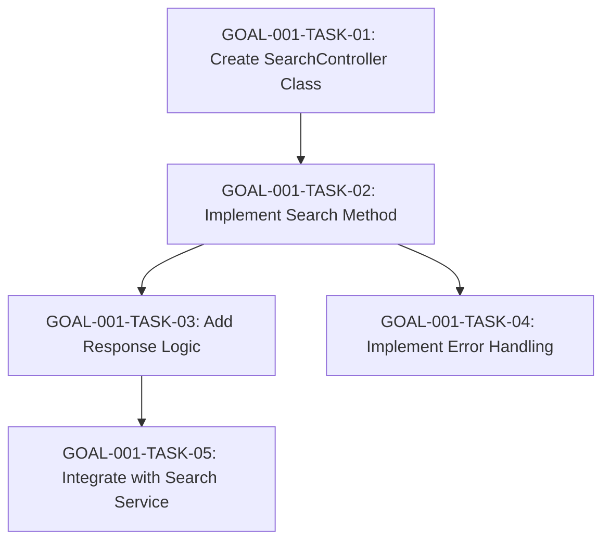

# Goal-001 Execution Plan

## Task Sequence and Dependencies

The tasks for Goal-001 are sequenced based on dependencies to ensure modularity and low coupling. The sequence starts with the foundational task and progresses through implementation, error handling, and integration. Each task must be completed before its dependencies are met.

### Mermaid Diagram

### Execution Order
1. **GOAL-001-TASK-01**: Create SearchController Class – No dependencies, must be first.
2. **GOAL-001-TASK-02**: Implement Search Method – Depends on GOAL-001-TASK-01.
3. **GOAL-001-TASK-03**: Add Response Logic – Depends on GOAL-001-TASK-02.
4. **GOAL-001-TASK-04**: Implement Error Handling – Depends on GOAL-001-TASK-02.
5. **GOAL-001-TASK-05**: Integrate with Search Service – Depends on GOAL-001-TASK-03.

### Key Considerations
- **Modularity**: Each task focuses on a specific component to maintain low coupling.
- **Effort Estimation**: Each task is estimated to take 1 hour, but actual time may vary.
- **Dependencies**: Tasks are ordered to build upon previous deliverables.
- **Automation Level**: Medium, so assignments will be handled with appropriate delegation.