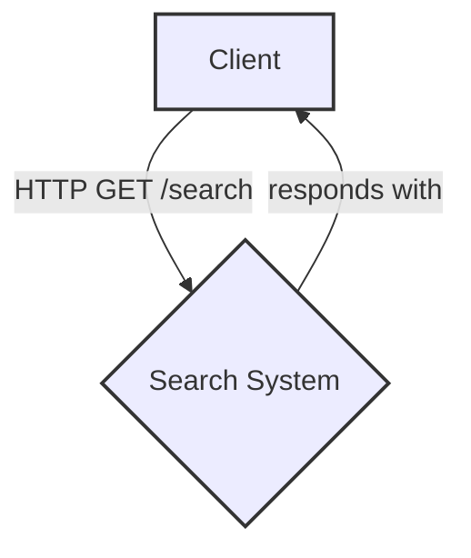
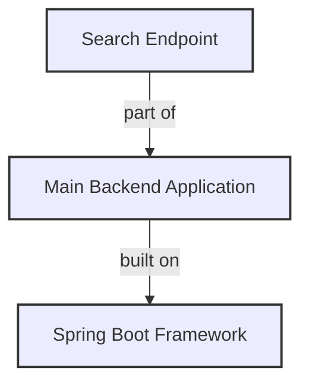

## Architecture Diagrams

### System Context Diagram
This diagram shows the high-level context of the search system, including external actors and the system boundaries.

**Explanation:** The system represents the backend search endpoint. The client is an external actor making requests. This is a simplified context diagram to establish the system's boundaries.

### Containers Diagram
This diagram depicts the high-level components and their relationships within the search system.

**Explanation:** The search endpoint is a component within the main backend application, which is built using the Spring Boot framework. This diagram emphasizes the modular nature of the system for future extensibility.